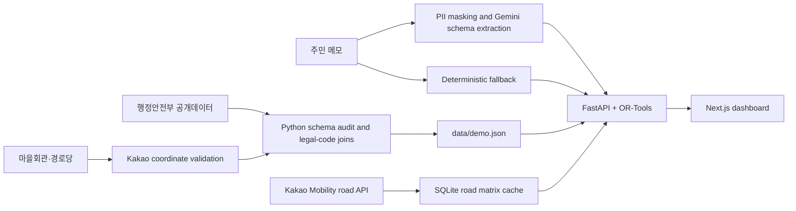

# VillageCoverage

**농촌 생활서비스 공급계획 시뮬레이터** — 제한된 예산으로 어디까지
서비스할 수 있는지, 기록이 적은 마을까지 최소 서비스를 보장하려면
얼마가 더 필요한지 비교하는 B2G 의사결정 지원 프로토타입입니다.

> **Pre-R&D prototype:** population, household, facility, and route inputs use
> live public/provider data. Resident service demand, provider schedules and
> capacity, service prices, and operating conditions are `SIMULATED FOR PRE-R&D`.
> Synthetic operating values are not field-survey findings.

## Why it exists

A small number of service requests does not prove that a rural area has no
need. VillageCoverage keeps observed requests separate from modeled service
need, flags weak evidence for follow-up survey, and lets a local planner compare
efficiency, balance, and a minimum-coverage guarantee. AI structures a resident
note into a reviewable draft; OR-Tools plans allocation and Kakao Mobility
provides road distance/time. AI does not plan routes.

## Prototype features

- Korean dashboard for 16 legal-ri areas in Hongseong-gun Janggok-myeon.
- Budget what-if slider and efficiency, balanced, and minimum-coverage
  scenarios.
- Low-data protection and a survey-required status that cannot be overridden
  by a model confidence score.
- Optional Gemini JSON-structured note extraction with common PII masking,
  local fallback, and human review.
- Kakao map with an accessible coordinate-map fallback, village details, data
  quality, provenance, and methodology pages.
- Live API/schema reports and reproducible synthetic pre-R&D experiments.

## Architecture



See [docs/ARCHITECTURE.md](docs/ARCHITECTURE.md) for boundaries and runtime
details.

## Live data validation

These commands call real services. Set valid keys in a local `.env` first; do
not paste keys into terminal output, source files, or screenshots.

```sh
cp .env.example .env
# Edit .env locally with data.go.kr, Kakao, and Gemini values.
uv sync --all-groups
uv run python scripts/api_smoke_test.py
uv run python scripts/build_demo_data.py
uv run python scripts/build_travel_matrix.py
```

`api_smoke_test.py` checks legal codes, population, single households,
facilities, Kakao address search, road directions, Maps SDK endpoint response,
and Gemini structured output. An SDK HTTP response alone does not prove a
browser map initialized; the development dashboard exposes the SDK, callback,
map-instance, and overlay-count diagnostic. The report is written to `artifacts/api_smoke_report.json`;
secret values and raw records are not saved. The public-data builder writes
`data/demo.json`, `artifacts/public_schema_manifest.json`,
`artifacts/data_quality_report.json`, and `docs/DATA_DICTIONARY.md`. It discards
facility contact/name/address details. The route builder writes a local ignored
SQLite cache and a summary report.

The official population catalog page currently links one CSV, and that download
contains Chungcheongnam-do only; the single-household data covers 16 provinces.
The cause of this publication gap is not established. The pilot only joins
areas with exact 10-digit legal codes. See
[docs/DATA_QUALITY_REPORT.md](docs/DATA_QUALITY_REPORT.md).

## Run locally

Start the backend from the repository root:

```sh
uv run uvicorn backend.main:app --reload --host 127.0.0.1 --port 8000
```

In another terminal, start the frontend:

```sh
cd frontend
npm ci
npm run dev
```

Open <http://localhost:3000>. The frontend reads only `NEXT_PUBLIC_*` values
from the repository-root `.env`; the API and AI keys stay server-side. If the
Kakao Maps JavaScript key is unavailable, the coordinate map remains visible
with an explicit diagnostic. In Kakao Developers, add the exact development
origin `http://localhost:3000` under **앱 → 플랫폼 키 → JavaScript 키 →
JavaScript SDK 도메인**. A different host, scheme, or port is a different
origin; use the matching production origin when deployed.
Dashboard route planning requires a complete local SQLite road cache.

## Environment variables

| Variable | Use | Exposure |
|---|---|---|
| `DATA_GO_KR_SERVICE_KEY` | Public-data smoke and ingestion | Server only |
| `KAKAO_REST_API_KEY` | Address and route APIs | Server only |
| `NEXT_PUBLIC_KAKAO_MAP_JS_KEY` | Browser Maps SDK | Public browser key; restrict allowed domains in Kakao Developers |
| `GEMINI_API_KEY` | Optional note structuring | Server only |
| `GEMINI_MODEL` | Structured-output model name | Server config, default `gemini-3.5-flash-lite` |
| `NEXT_PUBLIC_API_BASE_URL` | Browser API base URL | Public browser config |
| `FRONTEND_ORIGINS` | Comma-separated allowed browser origins | Backend config |
| `VILLAGE_COVERAGE_DB` | SQLite route-cache path | Backend config |

`.env` is ignored by Git and Docker. `.env.example` contains no real key.

## Tests, experiments, and production build

```sh
uv run pytest -q
uv run ruff check .
uv run python scripts/run_experiments.py
cd frontend
npm run lint
npm run typecheck
npm run build
```

The GitHub Actions workflow runs backend tests/lint and frontend lint,
typecheck, and production build. Live provider checks are skipped when required
GitHub secrets are unavailable.

## Screenshots

<!-- Add applicant-approved, redacted dashboard and demand-structuring screenshots here before submission. -->

Container configuration is provided in `backend/Dockerfile`,
`frontend/Dockerfile`, and `docker-compose.yml`. A deployment needs a persistent
SQLite volume and a complete Kakao route matrix. Initialize the volume by
running `scripts/build_travel_matrix.py` in the backend container with the
server-side Kakao key available. Configure the public API URL and allowed
frontend origin for the deployment domain.

## Data and limitations

- **Real public data:** legal codes; population and single-household counts;
  village facility coordinates/counts; Kakao coordinates and road routes.
- **Synthetic pre-R&D inputs:** service requests, provider schedules/capacity,
  modeled need, prices, and operating conditions. No real resident service
  count is estimated.
- Provider capacity is aggregated, and the road cost model adds each area's
  round-trip cost from one representative hub. It does not schedule individual
  providers or optimize a multi-stop vehicle route.
- A legal-ri aggregate is not a household estimate for a natural village or
  administrative sub-village. Never split it by an unverified ratio.
- The note PII masker checks common patterns and is not a full anonymization
  system. Do not use identifiable resident data without an approved governance
  process.
- Public route caching and demo redistribution should be checked against the
  providers' current terms before a public deployment or broad reuse.

## Competition context

The supplied idea proposal, competition notice, and four-page result-report
template define the product principles. No applicant personal information from
those attachments is stored here. The report template sections and remaining
submission tasks are in [docs/SUBMISSION_CHECKLIST.md](docs/SUBMISSION_CHECKLIST.md).
The supplied notice stated a 2026-10-31 24:00 deadline; confirm current rules
with the organizer before submission.

## Demo workflow

Use [docs/DEMO_SCRIPT.md](docs/DEMO_SCRIPT.md) for the 2–5 minute story:
request-count allocation, low-data protection, note structuring, scenario
comparison, and the cost of minimum coverage.

V4 evidence and model limits are documented in
[docs/EMPIRICAL_EVIDENCE.md](docs/EMPIRICAL_EVIDENCE.md),
[docs/MODEL_CARD_DEMAND.md](docs/MODEL_CARD_DEMAND.md),
[docs/OPTIMIZER_CARD.md](docs/OPTIMIZER_CARD.md),
[docs/PUBLIC_SECTOR_WORKFLOW.md](docs/PUBLIC_SECTOR_WORKFLOW.md), and
[docs/LIMITATIONS.md](docs/LIMITATIONS.md). Run the automated desktop workflow
with `cd frontend && npm run test:e2e`; screenshots and export files are saved
under `frontend/test-results/e2e/`.

V4 reproducible experiments:

- `.venv/bin/python scripts/run_empirical_ingestion.py` refreshes public-source snapshots.
- `.venv/bin/python scripts/run_demand_model_benchmark.py` compares demand estimators.
- `.venv/bin/python scripts/run_forecast_backtest.py` keeps synthetic, Home Doctor, and local data results separate.
- `.venv/bin/python scripts/run_solver_benchmark.py` profiles build and solve stages at five scales.
- `.venv/bin/python scripts/run_stress_tests.py --v4-stratified --strict-wall-clock --route-strategy auto` writes the deterministic 100-case matrix to separate V4 artifacts.
- `.venv/bin/python scripts/run_policy_sensitivity.py` and `.venv/bin/python scripts/run_public_value_experiment.py` write controlled sensitivity and counterfactual artifacts.

The policy and public-value artifacts are synthetic controlled experiments;
they do not establish local resident demand or actual provider availability.

## V5.2 pilot data lifecycle

Pilot Setup creates a named `PILOT` or `SYNTHETIC_REHEARSAL` context. The CSV
preview and explicit confirmation pipeline promotes valid rows into
context-scoped records with source type, provenance, batch ID, and row
fingerprint. Pilot plans use only that context; the demo fixtures are not a
fallback. Review [docs/PILOT_DATA_LIFECYCLE.md](docs/PILOT_DATA_LIFECYCLE.md)
for mapping, assumptions, snapshot, and freshness rules, and
[docs/PILOT_EXECUTION_FEEDBACK_LOOP.md](docs/PILOT_EXECUTION_FEEDBACK_LOOP.md)
for approval, execution logs, and post-plan metrics.

Synthetic rehearsal output is explicitly labeled and is not field evidence.
This is a prototype: role selectors are not authentication, privacy masking is
best-effort, and the institution must approve real-data use and retention.
