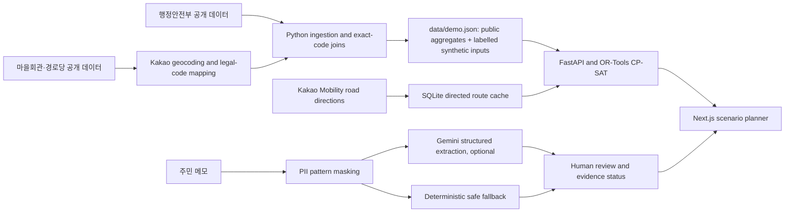

# Architecture

## Scope

VillageCoverage is a Korean-language B2G planning prototype for comparing rural
living-service allocation choices. It keeps resident-note structuring separate
from deterministic optimization and marks unobserved operational data as
`SIMULATED FOR PRE-R&D`.

## Components

- `scripts/api_smoke_test.py` performs opt-in live checks and writes a
  secret-safe report. It does not store raw public API responses.
- `scripts/build_demo_data.py` downloads four public sources, audits observed
  schemas, joins legal-area data, and generates a fixture of 54 legal-ri service areas across three towns.
- `backend/data_ingestion.py` parses the CSV export and computes observed age
  bands without fabricating missing columns.
- `backend/travel.py` caches directed Kakao Mobility distance/time by exact
  coordinates, route version, and priority. Missing routes fail closed; there
  is no straight-line substitute.
- `backend/demand.py` masks common PII patterns, validates Gemini JSON output
  against locally recognized facts, and calculates a deterministic evidence
  score. Remote extraction is optional.
- `backend/optimization.py` runs efficiency, balanced, underserved-first, and
  minimum-service-guarantee scenarios using OR-Tools CP-SAT. The pilot path
  pins `BASELINE_DECOMPOSED`; geographic and rolling-horizon strategies are
  experimental and are not the default.
- `backend/main.py` exposes the read-only planning API and the note-structuring
  endpoint. API secrets stay server-side.
- `frontend/` contains the Next.js dashboard, Kakao map, village detail,
  structured-note demo, data quality, and methodology screens.

## Runtime data

`data/demo.json` contains public aggregate population/household statistics,
facility counts, representative public-facility coordinates, 51 minimized
row-level facility records for 22 Buyeo areas, and explicitly synthetic
demand/provider assumptions. Hongseong and Asan remain aggregate-only. The
fixture deliberately excludes facility names, addresses, phone numbers, and
manager fields. The Kakao route cache is local or deployment-volume state and
is excluded from Git.

SQLite v12 includes an optional row-level `facilities` table for minimized
public attributes (type, operating state, coordinates, build date, floor area,
source reference date and dataset ID). Database-generated facility fingerprints
use only those allowlisted attributes; raw source identifiers and facility
contact/location text are never persisted. The checked-in detail rows come
only from the source whose page recorded unrestricted reuse; the other two
regions retain `AGGREGATE_ONLY` status. See `docs/DATA_DICTIONARY.md` for the
source, fields, date, and scope.

## Deployment boundary

The backend container expects a persistent SQLite volume populated with the
complete road matrix. Generate it with `scripts/build_travel_matrix.py` after
the container has access to `KAKAO_REST_API_KEY`. The frontend build accepts
`NEXT_PUBLIC_API_BASE_URL` and the browser-visible Kakao Maps JavaScript key.
Only `NEXT_PUBLIC_*` settings are loaded from the repository-root `.env` by the
Next config; server-only keys are not copied into the frontend build.

See [DATA_PROVENANCE.md](DATA_PROVENANCE.md) and
[OPTIMIZATION_MODEL.md](OPTIMIZATION_MODEL.md) for source and model limits.
The local dashboard uses the checked-in fixture. It does not fetch public data
on startup. A complete directed road matrix is a separate local SQLite cache;
missing routes fail closed rather than using a straight-line estimate.

## V5.2 pilot control plane

`backend/pilot_imports.py` validates CSV rows before explicit confirmation.
`backend/pilot_lifecycle.py` promotes confirmed rows into
`pilot_promoted_records`, scoped by `pilot_context_id`, and assembles planning
inputs without loading seeded demo data. `pilot_service_mapping_reviews` gates
provider/service joins; `pilot_scenario_assumptions` records non-imported route,
base-location, service-time, or price assumptions with a reason and provenance.

`pilot_plans` stores a solver result plus immutable context, region, demand,
provider, import-batch, assumption, mapping-review, source-lineage, and route
fingerprints. The pilot endpoint pins planning to `BASELINE_DECOMPOSED`; other
strategies remain experimental. Approval status and execution logs use separate
pilot tables so the existing demo plan lifecycle is not mutated. See
[PILOT_DATA_LIFECYCLE.md](PILOT_DATA_LIFECYCLE.md) for the transaction and
snapshot contract.
