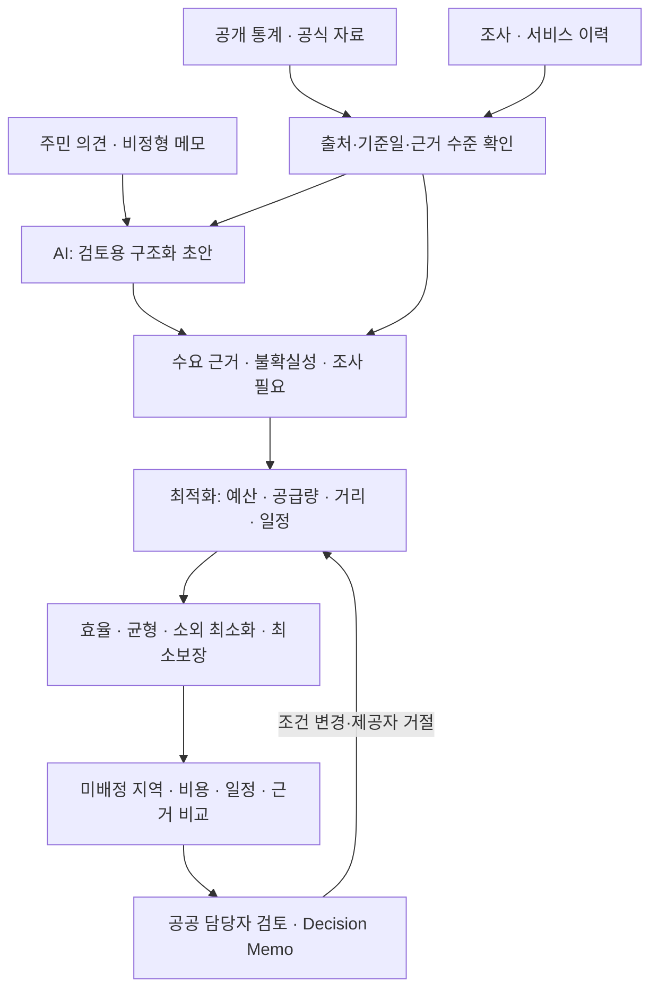

# 보고서용 구조도 초안

공식 양식 공간이 허용될 때만 사용한다. 표·화살표·짧은 말로 1/4 페이지 안에 배치하고 endpoint, class, DB table, framework 이름은 넣지 않는다.

시각적 구분: AI 영역은 자유기록을 구조화하고 부족한 근거를 표시한다. 최적화 영역은 배정·예산·공급자·일정·경로 제약을 계산한다. 마지막 결정과 승인 책임은 공공 담당자에게 있다. 이 도식은 현재 구현 개념 설명이지 운영 현장 또는 정식 배포 아키텍처 검증 도면이 아니다.
